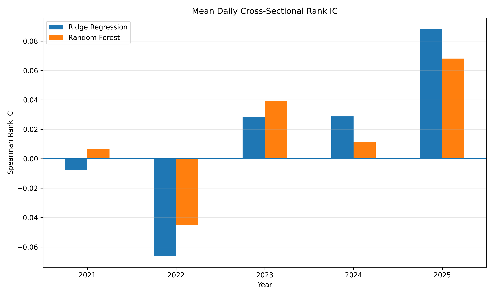
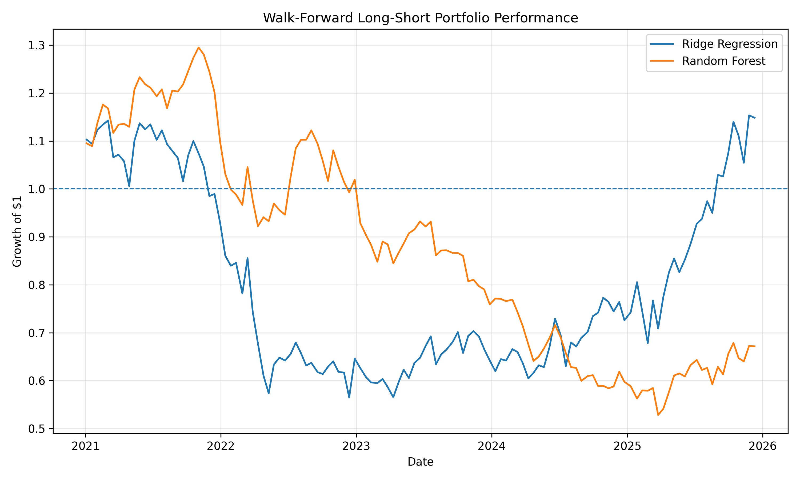
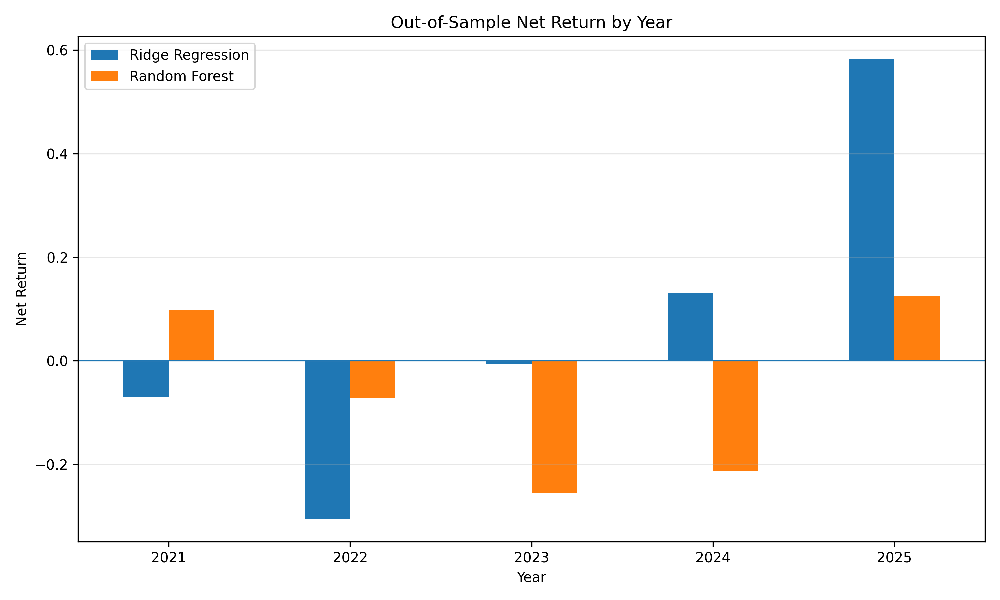

# Machine Learning for Cross-Sectional Equity Return Prediction

An empirical study of whether price, momentum, volatility, and volume features can predict the relative 10-day performance of U.S. large-cap equities.

Rather than attempting to predict exact stock prices, this project frames equity prediction as a cross-sectional ranking problem: given information available at time \(t\), can a model identify which stocks are likely to outperform or underperform their peers over the next 10 trading days?

## Research Question

Can machine learning models use historical market information to predict cross-sectional differences in future equity returns?

The target for stock \(i\) at time \(t\) is:

```text
10-day stock return - cross-sectional median 10-day return
```

This removes much of the common market movement and focuses the model on relative stock performance.

## Data

Daily adjusted OHLCV data was collected using the Alpaca Market Data API.

- Universe: current S&P 100 securities
- Period: January 2016 – December 2025
- Raw observations: ~251,000
- Frequency: daily
- Corporate-action adjustment: splits and dividends

The use of current S&P 100 constituents introduces survivorship bias and is discussed as a limitation below.

## Features

Seven predictors were constructed using only information available at or before each prediction date:

- 5-day momentum
- 20-day momentum
- 60-day momentum
- 20-day realized volatility
- Volume relative to its 20-day average
- Price relative to its 20-day moving average
- 20-day momentum relative to the cross-sectional median

Extreme feature observations were winsorized using bounds estimated exclusively from each training sample.

## Models

Two models were compared:

### Ridge Regression

A regularized linear baseline designed to handle correlated predictors such as overlapping momentum and trend features.

### Random Forest

A nonlinear ensemble model capable of learning interactions and nonlinear relationships among market features.

## Walk-Forward Validation

Models were evaluated using expanding-window walk-forward testing rather than a random train/test split.

```text
Train 2016–2020 → Test 2021
Train 2016–2021 → Test 2022
Train 2016–2022 → Test 2023
Train 2016–2023 → Test 2024
Train 2016–2024 → Test 2025
```

The final 10 trading days before each test period were purged from training because their forward-return labels overlap the test period.

This structure more closely approximates how a model would have been trained using information available at the time.

## Predictive Results

Mean daily Spearman rank information coefficient across the complete walk-forward period:

| Model | Mean Rank IC |
|---|---:|
| Ridge Regression | 0.0136 |
| Random Forest | 0.0155 |

Predictive performance varied considerably across years.



The results suggest weak cross-sectional predictive information, but the instability across periods indicates substantial regime dependence.

## Portfolio Backtest

Predictions were converted into an equal-weight long-short strategy.

Every 10 trading days:

- Long the top prediction decile
- Short the bottom prediction decile
- Hold for 10 trading days
- Rebalance
- Apply an assumed 10 bps transaction cost per side of each entry/exit

### Overall Results

| Metric | Ridge Regression | Random Forest |
|---|---:|---:|
| Gross Annualized Return | 13.71% | 2.10% |
| Net Annualized Return | 2.83% | -7.71% |
| Net Annualized Volatility | 25.73% | 18.68% |
| Net Sharpe Ratio | 0.24 | -0.34 |
| Maximum Drawdown | -50.57% | -59.21% |
| Win Rate | 50.40% | 45.60% |



Performance varied substantially by year.



For example, the Ridge strategy performed poorly during 2022 but strongly during 2025. This instability reinforces the difference between finding statistical predictability and identifying a robust, economically exploitable trading strategy.

## Key Findings

1. Both models exhibited weak positive average cross-sectional ranking ability over the complete walk-forward period.
2. Predictive performance was highly unstable across years.
3. The nonlinear Random Forest did not translate its slightly higher overall Rank IC into superior portfolio performance.
4. Transaction costs materially reduced strategy returns.
5. Model complexity did not guarantee better out-of-sample trading performance.
6. Results illustrate the importance of chronological validation and realistic trading assumptions in financial machine learning.

## Limitations

This project is an empirical research exercise rather than evidence of a deployable trading strategy.

Important limitations include:

- **Survivorship bias:** the universe uses current S&P 100 constituents rather than historical membership.
- **Transaction-cost approximation:** costs are modeled using a fixed assumption rather than security-specific bid-ask spreads and slippage.
- **Shorting assumptions:** the backtest does not explicitly model stock borrow availability or borrow fees.
- **Execution assumptions:** the research uses daily data and does not model intraday execution.
- **Limited feature set:** only price, volatility, and volume-derived predictors are included.
- **Regime dependence:** predictive and portfolio performance vary substantially across years.

## Project Structure

```text
ml-equity-return-research/
├── src/
│   ├── data.py
│   ├── universe.py
│   ├── eda.py
│   ├── features.py
│   ├── models.py
│   ├── backtest.py
│   └── visualize.py
├── data/
│   ├── raw/
│   └── processed/
├── results/
│   ├── equity_curve.png
│   ├── yearly_returns.png
│   └── yearly_rank_ic.png
├── requirements.txt
├── .gitignore
└── README.md
```

## Technologies

Python, pandas, NumPy, scikit-learn, Matplotlib, Alpaca Market Data API, Parquet

## Reproducibility

Install dependencies:

```bash
pip install -r requirements.txt
```

Add Alpaca API credentials to a local `.env` file:

```text
ALPACA_API_KEY=your_key
ALPACA_SECRET_KEY=your_secret
```

Then run:

```bash
python src/data.py
python src/eda.py
python src/features.py
python src/models.py
python src/backtest.py
python src/visualize.py
```

Market data and API credentials are excluded from version control.